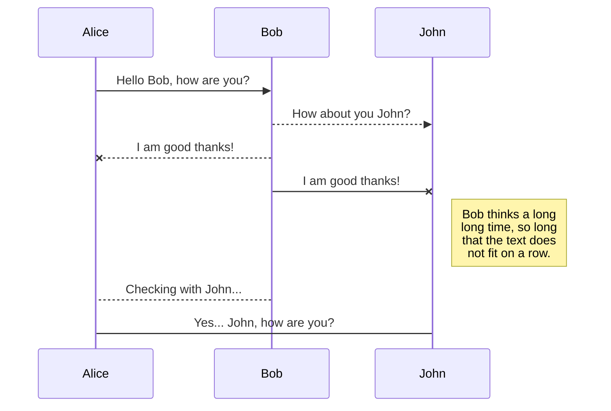
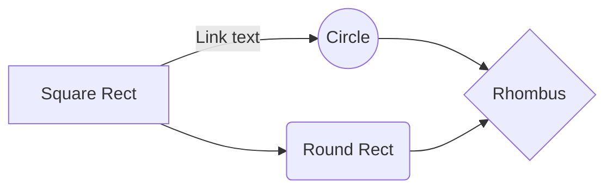

<!-- @import "[TOC]" {cmd="toc" depthFrom=1 depthTo=6 orderedList=false} -->

<!-- code_chunk_output -->

- [Title 1 h1](#title-1-h1)
    - [Title 2 h2](#title-2-h2)
- [Title 2 h1](#title-2-h1)
    - [Title 3 h2](#title-3-h2)
        - [Title 4 h3](#title-4-h3)
    - [This is a pen](#this-is-a-pen)

<!-- /code_chunk_output -->

# Title 1 h1
Hello World
**Good morning**

It is fine
## Title 2 h2
**日本語表記**
この文字はみえるでしょうか？  明日の
なかなか
  
# Title 2 h1
## Title 3 h2
### Title 4 h3

[Google](https://www.google.com)

1. [**Good morning**](https://www.yahoo.com)
2. **daytime**
3. **evening**

+ dog
+ cat
+ mouse

[Google][ggl]  
[Yahoo] or [MSN]

[ggl]:https://google.com
[Yahoo]:https://yahoo.com
[MSN]: https://msn.com

```code

    int main(char argv[], int argc){
        printf("Hello world Hwllo World Hellow World")
    }
```

## This is a pen






